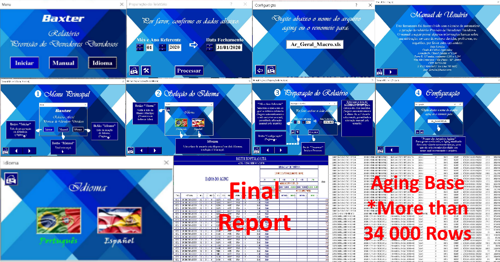

# VBA AFDA Report

**_Allowance for Doubtful Accounts Multilingual Report Tool PTBR/ESP in VBA_**

Purpose:
A tool for "Baxter International Inc." in order to replace a pre-existing report in SAP Crystal due to the software's demise by the company, with multilingual (PTBR/ESP) feature to assist in the migration of Baxter Brazil's accounting to outsourced in Costa Rica (The report is used by employees from both Brazil and Costa Rica).

Applicability:
The tool generates Allowance for Doubtful Accounts Reports based on the Accounts Receivable Aging data (AR Aging is another periodic report that categorizes a company's accounts receivable according to the length of time an invoice has been outstanding).
