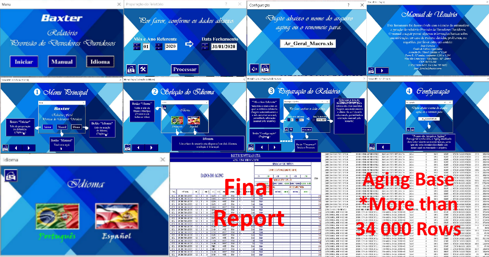
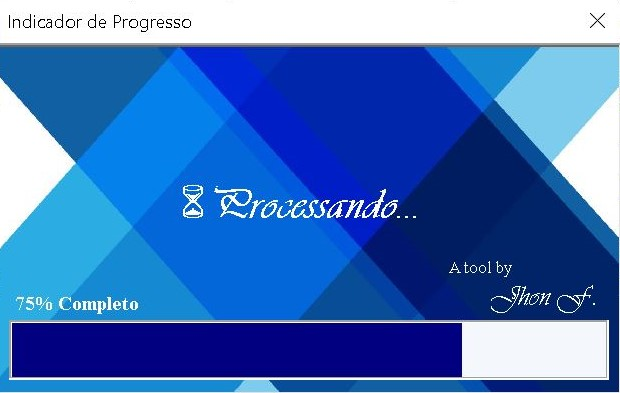

# VBA AFDA Report

### **_Allowance for Doubtful Accounts Multilingual Report Tool PTBR/ESP in VBA_**

 

#### Purpose:
A tool for Baxter International Inc., in order to replace a pre-existing report in SAP Crystal due to the software's demise by the company, with multilingual (PTBR/ESP) feature to assist in the migration of Baxter Brazil's accounting to outsourced in Costa Rica (The tool can be used and better understood on how it works by employees from both clusters).

#### Applicability:
The tool generates Allowance for Doubtful Accounts Reports based on the Accounts Receivable *Aging data. Obtaining invoices information according to 6 criteria, three from the old Brazilian AFDA legislation that is exercised on overdue invoices until Oct. 7, 2014 (Date the legislation was changed), and three from the new legislation that is exercised on overdue invoices after this date.
>*AR Aging is another periodic report that categorizes a company's accounts receivable according to the length of time an invoice has been outstanding.

